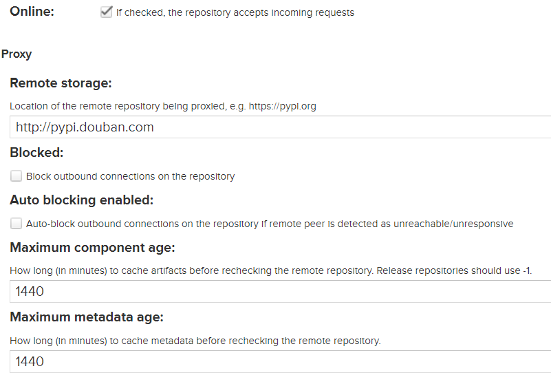
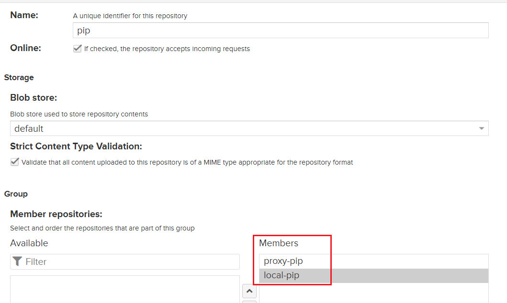
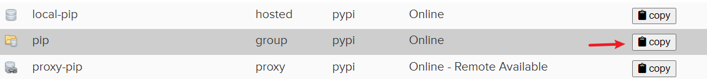
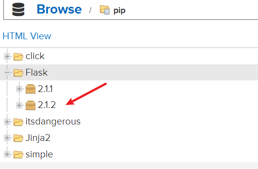

Python私服有三种类型：
- hosted : 本地存储，便于开发者将个人的一些包上传到私服中
- proxy : 提供代理其他仓库的类型，如豆瓣的pypi仓库
- group : 组类型，实质作用是组合多个仓库为一个对外的地址

## 新建一个proxy的仓库

参考：https://wiki.eryajf.net/pages/3167.html#_3-%E5%88%9B%E5%BB%BA%E4%B8%80%E4%B8%AAproxy%E7%B1%BB%E5%9E%8B%E7%9A%84pypi%E4%BB%93%E5%BA%93%E3%80%82

我们可以搭建一个proxy类型的仓库，这里我们可以使用国内的镜像来加快下载速度
```bash
http://pypi.douban.com
```



这里填写: http://pypi.python.org/pypi/ 上边的是官方的仓库地址，还有其他几个国内常见的，罗列如下：

- 阿里云：http://mirrors.aliyun.com/pypi/
- 中国科技大学：https://pypi.mirrors.ustc.edu.cn/
- 豆瓣：http://pypi.douban.com/
- 清华大学：https://pypi.tuna.tsinghua.edu.cn/
- 中国科学技术大学：http://pypi.mirrors.ustc.edu.cn/

## 新建一个local仓库
本地仓库主要是用于上传自己的包，这个地方默认就好

## 新建一个group仓库
这里我们可以把本地和代理的都加上去，它会把两个仓库整合起来


## 拷贝我们的地址


我们下载的时候需要自己手动在地址后面加上 `simple`

```bash
pip install --trusted-host 192.168.1.60 -i http://192.168.1.60:8000/repository/pip/simple Flask==2.1.2
```

还有，代理仓库一开始会提示下面这个错误
```
ERROR: Could not find a version that satisfies the requirement flask==2.1.2 (from versions: none)
ERROR: No matching distribution found for flask==2.1.2
```

我们可以等一下，等待出现对应的包，如果出现了就可以继续运行命令下载了

