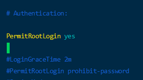
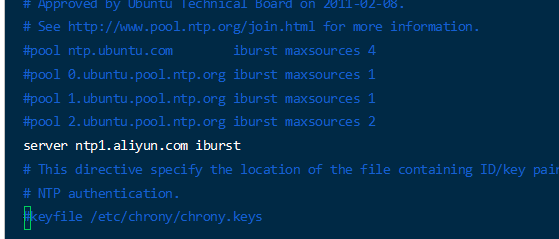

使用7个集群，一个master，另外6个为node，全部设置为6G运行内存

ip地址对应如下：
- master: 192.168.1.50
- node: 192.168.1.51
- node: 192.168.1.52
- node: 192.168.1.53
- node: 192.168.1.54
- node: 192.168.1.55
- node: 192.168.1.56

## SSH允许ROOT
> 使用一键安装脚本需要开启root用户，集群所有服务器账号密码都需要一样

```bash
# 设置root密码为xiaoyou
sudo passwd root
# 切换到root用户
su
# 修改SSH配置文件
sudo vim /etc/ssh/sshd_config
```

调整PermitRootLogin参数值为yes，如下图：


```bash
PermitRootLogin yes
# 重启SSH服务
sudo systemctl  restart  ssh
```

## 脚本一键安装
仓库地址 https://github.com/labring/sealos

```bash
 wget -c https://sealyun-home.oss-cn-beijing.aliyuncs.com/sealos/latest/sealos && \
    chmod +x sealos && mv sealos /usr/bin
wget -c https://sealyun.oss-cn-beijing.aliyuncs.com/05a3db657821277f5f3b92d834bbaf98-v1.22.0/kube1.22.0.tar.gz

# 安装命令如下
sudo sealos init --user root --passwd xiaoyou --master 192.168.1.50 --node 192.168.1.51 --node 192.168.1.52 --node 192.168.1.53 --node 192.168.1.54 --node 192.168.1.55 --node 192.168.1.56 --pkg-url /home/xiaoyou/kube1.22.0.tar.gz --version v1.22.0


#其他常用命令
# 添加master
sealos join --master 192.168.0.6 --master 192.168.0.7
# 添加节点
sealos join --node 192.168.0.6 --node 192.168.0.7
# 删除某个节点
sealos clean --master 192.168.0.2
sealos clean --node 192.168.0.5
# 删除所有集群
sealos clean --all
# 查看所有节点
kubectl get nodes
```


## 拉取私有docker镜像
> 我们部署好的docker使用containerd 来作为镜像的拉取，我们需要配置一下才能拉取HTTP的镜像
> 注意，每个节点都需要配置
> 参考：https://www.jianshu.com/p/90a0c85d263d

```bash
# 先自己生成配置文件
mkdir /etc/containerd && containerd config default > /etc/containerd/config.toml
# 修改配置文件
vim /etc/containerd/config.toml
# 调整内容如下
[plugins."io.containerd.grpc.v1.cri".registry]
      [plugins."io.containerd.grpc.v1.cri".registry.mirrors]
        [plugins."io.containerd.grpc.v1.cri".registry.mirrors."docker.io"]
          endpoint = ["https://registry.cn-hangzhou.aliyuncs.com"]
        [plugins."io.containerd.grpc.v1.cri".registry.mirrors."registry.xiaoyou.com"]
          endpoint = ["http://192.168.1.60:8001"]
# 重启一下
systemctl restart containerd
# 拉取镜像测试一下（因为我们设置了域名，所以这个会自动替换成自己的私有仓库）
crictl pull registry.xiaoyou.com/nginx
```

## 时间同步
> 默认系统不是中国时间，我们需要自己配置一下，然后同步一下最新的时间
> 参考：https://www.cnblogs.com/JetpropelledSnake/p/10175763.html

```bash
# 安装一下
sudo apt install chrony -y
# 修改一下时区
timedatectl set-timezone Asia/Shanghai
# 查看我们的时区（后面要出现+0800）
date -R
# 修改时间服务器
vim /etc/chrony/chrony.conf
# 里面加上
server ntp1.aliyun.com iburst
```

修改成下面这样，最好把kes也注释掉


```bash
# 重启时间服务器
systemctl restart chronyd.service
# 开始同步
chronyc -a makestep
# 查看时间服务器信息
chronyc sourcestats
```


## 安装管理工具

> 安装地址：https://kuboard.cn/install/v3/install-built-in.html#%E9%83%A8%E7%BD%B2%E8%AE%A1%E5%88%92
> 管理工具需要在存储服务器上安装

```bash
# 使用下面的命令安装
sudo docker run -d \
  --restart=unless-stopped \
  --name=kuboard \
  -p 90:80/tcp \
  -p 91:10081/tcp \
  -e KUBOARD_ENDPOINT="http://192.168.1.60:90" \
  -e KUBOARD_AGENT_SERVER_TCP_PORT="91" \
  -v /root/kuboard-data:/data \
  eipwork/kuboard:v3
# 然后访问 http://192.168.1.60:90 就应该可以了，默认账号密码为 admin、Kuboard123
```

## 挂载NFS
```bash
# 所有子节点都需要安装
sudo apt-get install nfs-common
```
这个地方可能有个bug，一直处于pedding中
