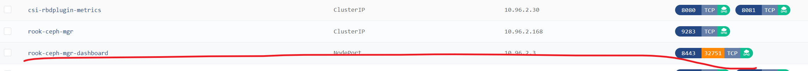

## 准备工作

因为我是4个子节点，所以我直接挂载了4块硬盘上去。我在节点机器上执行 `lsblk -f` 查看我们的磁盘是否需要被格式化,FSTYPE为空就可以了

> 这里我们的sdb可以拿来作为OSD来进行存储

```bash
xiaoyou@node1:~$ lsblk -f
NAME                      FSTYPE      LABEL                           UUID                                   FSAVAIL FSUSE% MOUNTPOINT
loop0                     squashfs                                                                                 0   100% /snap/core18/2409
loop1                     squashfs                                                                                 0   100% /snap/core20/1518
loop2                     squashfs                                                                                 0   100% /snap/lxd/21029
loop3                     squashfs                                                                                 0   100% /snap/snapd/16010
loop4                     squashfs                                                                                 0   100% /snap/core18/2128
loop5                     squashfs                                                                                 0   100% /snap/lxd/22753
sda                                                                                                                         
├─sda1                                                                                                                      
├─sda2                    ext4                                        1a76e0ac-49e3-421f-be6e-d9f504a3119e    800.5M    11% /boot
└─sda3                    LVM2_member                                 deH3dx-57Q1-LFfU-JjAN-Nwhd-LQA3-H67d8Y                
  └─ubuntu--vg-ubuntu--lv ext4                                        07a0c965-450c-4be6-aec8-0c4623a81ec0    269.3G     3% /
sdb                                                                                                           
```

使用下面的命令来快速安装
```bash
sudo kubectl create -f https://kuboard.cn/statics/learning/ceph/rook-1.5.4/crds.yaml
sudo kubectl create -f https://kuboard.cn/statics/learning/ceph/rook-1.5.4/common.yaml
sudo kubectl create -f https://kuboard.cn/statics/learning/ceph/rook-1.5.4/operator.yaml
sudo kubectl create -f https://kuboard.cn/statics/learning/ceph/rook-1.5.4/cluster.yaml
# 然后我们使用下面的命令来查看执行的状态
watch kubectl get pods -n rook-ceph 
```

下面我们可以手动创建一个文件存储服务(因为我就是本地测试，用的是同一块硬盘，所以直接只使用一个副本)
```bash
cat > myfs.yaml <<EOF
apiVersion: ceph.rook.io/v1
kind: CephFilesystem
metadata:
  name: data
  namespace: rook-ceph
spec:
  metadataPool:
    replicated:
      size: 1
  dataPools:
    - replicated:
        size: 1
  preservePoolsOnDelete: true
  metadataServer:
    activeCount: 1
    activeStandby: true
EOF

sudo kubectl create -f myfs.yaml
```

到这里其实就已经搭建好了，其他地方就不说了，参考一下 https://kuboard.cn/learning/k8s-intermediate/persistent/ceph/rook-config.html#%E5%89%8D%E6%8F%90%E6%9D%A1%E4%BB%B6 就可以了

## 监控面板

```bash
cat > dashboard-external-https.yaml <<EOF
---
apiVersion: v1
kind: Service
metadata:
  name: rook-ceph-mgr-dashboard-external-https
  namespace: rook-ceph
  labels:
    app: rook-ceph-mgr
    rook_cluster: rook-ceph
spec:
  ports:
  - name: dashboard
    port: 8443
    protocol: TCP
    targetPort: 8443
  selector:
    app: rook-ceph-mgr
    rook_cluster: rook-ceph
  sessionAffinity: None
  type: NodePort
EOF
# 运行
kubectl apply -f dashboard-external-https.yaml
```

其实就是把下面这个端口暴露出去


```bash
# 使用下面这个命令来获取密码，账号是admin
sudo kubectl -n rook-ceph get secret rook-ceph-dashboard-password -o jsonpath="{['data']['password']}" | base64 --decode && echo
```

## 工具箱

我们这里创建一个工具箱用于对ceph集群进行控制，为了保持版本一致，我们这里设置和教程一样的版本
https://github.com/rook/rook/releases/tag/v1.5.4

在 `cluster\examples\kubernetes\ceph` 里面有一个 `toolbox.yaml` 文件，可以自己替换一下镜像

```bash
apiVersion: apps/v1
kind: Deployment
metadata:
  name: rook-ceph-tools
  namespace: rook-ceph # namespace:cluster
  labels:
    app: rook-ceph-tools
spec:
  replicas: 1
  selector:
    matchLabels:
      app: rook-ceph-tools
  template:
    metadata:
      labels:
        app: rook-ceph-tools
    spec:
      dnsPolicy: ClusterFirstWithHostNet
      containers:
      - name: rook-ceph-tools
        image: registry.xiaoyou66.com/rook/ceph:v1.5.4
        command: ["/tini"]
        args: ["-g", "--", "/usr/local/bin/toolbox.sh"]
        imagePullPolicy: IfNotPresent
        env:
          - name: ROOK_CEPH_USERNAME
            valueFrom:
              secretKeyRef:
                name: rook-ceph-mon
                key: ceph-username
          - name: ROOK_CEPH_SECRET
            valueFrom:
              secretKeyRef:
                name: rook-ceph-mon
                key: ceph-secret
        volumeMounts:
          - mountPath: /etc/ceph
            name: ceph-config
          - name: mon-endpoint-volume
            mountPath: /etc/rook
      volumes:
        - name: mon-endpoint-volume
          configMap:
            name: rook-ceph-mon-endpoints
            items:
            - key: data
              path: mon-endpoints
        - name: ceph-config
          emptyDir: {}
      tolerations:
        - key: "node.kubernetes.io/unreachable"
          operator: "Exists"
          effect: "NoExecute"
          tolerationSeconds: 5
```

然后我们就可以直接进入这个容器对ceph集群进行各种操作了

## 开启对象存储

> 这里我们需要通过rook来操作，而不是直接使用控制台操作

```yaml
apiVersion: ceph.rook.io/v1
kind: CephObjectStore
metadata:
  name: index-data-obj
  namespace: rook-ceph
spec:
  metadataPool:
    failureDomain: host
    replicated:
      size: 2
  dataPool:
    failureDomain: osd
    erasureCoded:
      dataChunks: 2
      codingChunks: 1
  gateway:
    type: s3
    sslCertificateRef:
    port: 80
    securePort:
    instances: 1
    allNodes: false
    placement:
    resources:
```

然后我们创建一个用户(用户名为index-data-user)
```yaml
apiVersion: ceph.rook.io/v1
kind: CephObjectStoreUser
metadata:
  name: index-data-user
  namespace: rook-ceph
spec:
  store: index-data-obj
  displayName: "xiaoyou"
```

```bash
# 查看用户是否创建成功
sudo kubectl -n rook-ceph get cephobjectstoreuser
# 查看秘钥信息
sudo kubectl -n rook-ceph get secret/rook-ceph-object-user-index-data-obj-index-data-user -o jsonpath='{.data.AccessKey}' | base64 --decode
sudo kubectl -n rook-ceph get secret/rook-ceph-object-user-index-data-obj-index-data-user -o jsonpath='{.data.SecretKey}' | base64 --decode
```

然后我们还需要对外暴露端口
```yaml
apiVersion: v1
kind: Service
metadata:
  name: rook-ceph-rgw-index-data-obj-external
  namespace: rook-ceph
  labels:
    app: rook-ceph-rgw
    rook_cluster: rook-ceph
    rook_object_store: index-data-obj
spec:
  ports:
  - name: rgw
    port: 80
    protocol: TCP
    targetPort: 8080 # 这个地方要和前面那个保持一致，要不然会报错
  selector:
    app: rook-ceph-rgw
    rook_cluster: rook-ceph
    rook_object_store: index-data-obj
  sessionAffinity: None
  type: NodePort
```

> 如果想删除，直接使用 sudo kubectl delete -f xxx.yaml 就可以删除了


## 参考

- https://blog.csdn.net/aixiaoyang168/article/details/86467931
- https://rook.github.io/docs/rook/v1.5/ceph-object.html