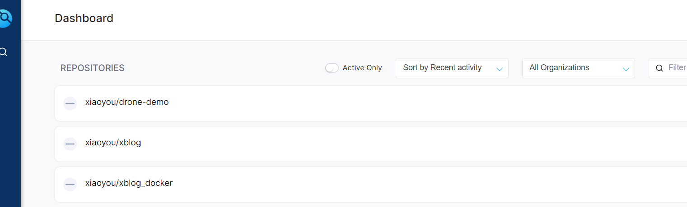
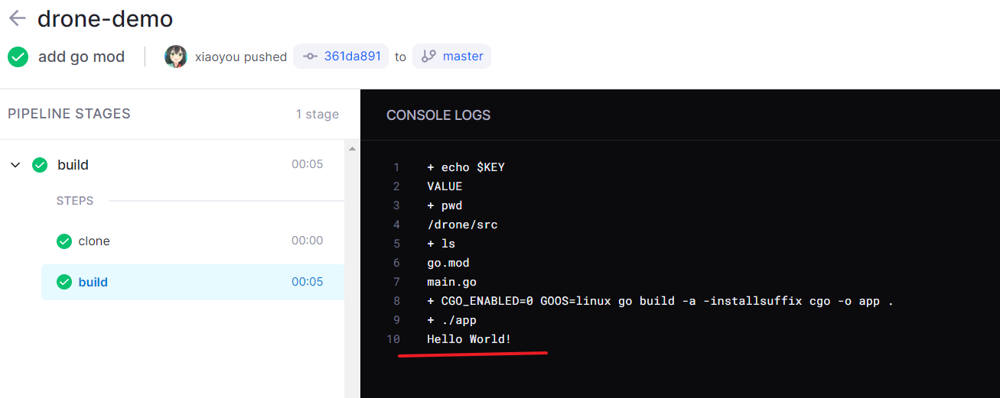

# 使用drone来进行自动化部署

参考 https://docs.drone.io/server/provider/gitea/

## 创建一个应用

自己到gitea哪里，点击头像->设置->应用->管理 OAuth2 应用程序 哪里自己创建一个新的应用，我的重定向url为 `http://drone.xiaoyou.com/login` 自己改成自己的，然后gitea会生成id和秘钥，然后保存


## 启动容器(安装在k8s上)

可以使用 `openssl rand -hex 16` 来随机生成秘钥

把前面配置好的一些信息修改成自己的，需要修改 `DRONE_GITEA_SERVER`,`DRONE_GITEA_CLIENT_ID`,`DRONE_GITEA_CLIENT_SECRET`
> 域名信息需要自己映射一下

```bash
sudo docker run \
  --volume=/var/lib/drone:/data \
  --env=DRONE_GITEA_SERVER=http://gitea.xiaoyou.com \
  --env=DRONE_GITEA_CLIENT_ID=f48c9fe6-82c3-42f9-b490-36bf7a0b11ef \
  --env=DRONE_GITEA_CLIENT_SECRET=2vxDlBKuOQx8rIaY2LNkSNrnktMfW1xTft1vLSfXjuiQ \
  --env=DRONE_RPC_SECRET=4b165e989d3ef30da50b12d859340e53 \
  --env=DRONE_SERVER_HOST=drone.xiaoyou.com \
  --env=DRONE_SERVER_PROTO=http \
  --publish=80:80 \
  --restart=always \
  --detach=true \
  --name=drone \
  drone/drone:2
```

登录 `drone.xiaoyou.com` 然后我们授权一下应用就可以看到我们的项目了



## 安装执行器（安装在docker上）

前面安装好了界面后我们可以部署一下执行器来执行应用

```bash
# 下载执行器
docker pull drone/drone-runner-docker:1
# 启动容器（需要替换DRONE_RPC_HOST和DRONE_RPC_SECRET）
sudo docker run --detach \
  --volume=/var/run/docker.sock:/var/run/docker.sock \
  --env=DRONE_RPC_PROTO=http \
  --env=DRONE_RPC_HOST=drone.xiaoyou.com \
  --env=DRONE_RPC_SECRET=4b165e989d3ef30da50b12d859340e53 \
  --env=DRONE_RUNNER_CAPACITY=2 \
  --env=DRONE_RUNNER_NAME=runner \
  --publish=3000:3000 \
  --restart=always \
  --name=runner \
  --privileged=true \
  drone/drone-runner-docker:1
# 查看一下日志信息
sudo docker logs runner
# 如果启动成功会有下面的信息
time="2022-06-05T16:10:11Z" level=info msg="successfully pinged the remote server"
```

## 自动化部署

我们这里使用一个最简单的例子，运行一个go项目，自己使用 `go mod init` 新建一个项目，然后新建一个`main.go`，代码如下：
```go
package main

import "fmt"

func main(){
    fmt.Printf("Hello World!\n");
}
```

然后新建一个 `.drone.yml` 这里面有自动构建的信息，内容如下
```yml
kind: pipeline
type: docker
name: build
steps:
- name: build
  image: golang:alpine
  pull: if-not-exists # always never
  environment:
    KEY: VALUE
  commands:
    - echo $KEY
    - pwd
    - ls
    - CGO_ENABLED=0 GOOS=linux go build -a -installsuffix cgo -o app .
    - ./app

trigger:
  branch:
  - master
```

然后自己到drone里面构建一下，如果出现下面的内容就说明搭建成功了~



yaml文件使用可以参考：https://docs.drone.io/pipeline/docker/syntax/platform/

## 自动推送到自己的私有仓库

drone配置
```yml
kind: pipeline
type: docker
name: build
steps:
  - name: build # 构建阶段
    image: golang:alpine
    pull: if-not-exists # 镜像拉取策略
    commands: # 下面这里是我们执行的命令。这里我们是使用go去编译项目
      - CGO_ENABLED=0 GOOS=linux go build -a -installsuffix cgo -o app .
  - name: push # 自动推送到私有仓库
    image: plugins/docker
    pull: if-not-exists # 镜像拉取策略
    settings:
      registry: registry.xiaoyou66.com # 私有仓库地址
      repo: registry.xiaoyou66.com/xiaoyou/demo1 # 仓库全称
      use_cache: true
      username: admin # 设置私有仓库的账号密码
      password: xiaoyou
      tags: # 设置我们的标签
        - latest
        - 0.0.1
trigger: # 这里设置使用master分支来触发
  branch:
  - master
```

Dockerfile配置
```bash
FROM alpine
WORKDIR /app
COPY app ./
ENV TZ=Asia/Shanghai
ENTRYPOINT ./app
```