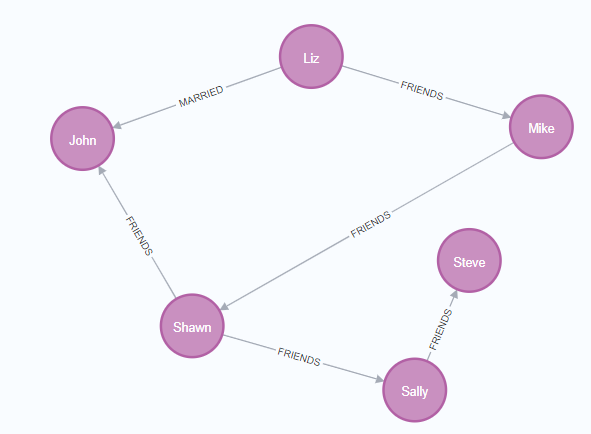

# Neo4j

## 部署
```yaml
---
kind: StatefulSet
apiVersion: apps/v1
metadata:
  name: neo4j
  namespace: xiaoyou-database
  labels:
    k8s.kuboard.cn/layer: db
    k8s.kuboard.cn/name: neo4j
spec:
  replicas: 1
  selector:
    matchLabels:
      k8s.kuboard.cn/layer: db
      k8s.kuboard.cn/name: neo4j
  template:
    metadata:
      creationTimestamp: null
      labels:
        k8s.kuboard.cn/layer: db
        k8s.kuboard.cn/name: neo4j
    spec:
      volumes:
        - name: volume-bircj
          persistentVolumeClaim:
            claimName: database
      containers:
        - name: neo4j
          image: registry.xiaoyou66.com/library/neo4j
          resources: {}
          volumeMounts:
            - name: volume-bircj
              mountPath: /data
              subPath: neo4j
          terminationMessagePath: /dev/termination-log
          terminationMessagePolicy: File
          imagePullPolicy: Always
      restartPolicy: Always
      terminationGracePeriodSeconds: 30
      dnsPolicy: ClusterFirst
      securityContext: {}
      schedulerName: default-scheduler
  serviceName: neo4j
  podManagementPolicy: OrderedReady
  updateStrategy:
    type: RollingUpdate
    rollingUpdate:
      partition: 0
  revisionHistoryLimit: 10

---
kind: Service
apiVersion: v1
metadata:
  name: neo4j
  namespace: xiaoyou-database
  labels:
    k8s.kuboard.cn/layer: db
    k8s.kuboard.cn/name: neo4j
spec:
  ports:
    - name: necsmf
      protocol: TCP
      port: 7474
      targetPort: 7474
      nodePort: 32281
    - name: 2bfbtf
      protocol: TCP
      port: 7687
      targetPort: 7687
      nodePort: 32297
  selector:
    k8s.kuboard.cn/layer: db
    k8s.kuboard.cn/name: neo4j
  type: NodePort
  sessionAffinity: None
  externalTrafficPolicy: Cluster
  ipFamilies:
    - IPv4
  ipFamilyPolicy: SingleStack
  internalTrafficPolicy: Cluster
```

默认的连接端口是 `7687`，账号密码都是 `neo4j`，连接后需要修改密码

## 常用命令
```bash
# 删除所有数据 MATCH是匹配操作，而小括号()代表一个节点node（可理解为括号类似一个圆形），括号里面的n为标识符。
MATCH (n) DETACH DELETE n
# 创建一个人物节点，CREATE是创建操作，Person是标签，代表节点的类型。花括号{}代表节点的属性，属性类似Python的字典。这条语句的含义就是创建一个标签为Person的节点，该节点具有一个name属性，属性值是John。
CREATE (n:Person {name:'John'}) RETURN n
# 下面创建更多的人物节点
CREATE (n:Person {name:'Sally'}) RETURN n;
CREATE (n:Person {name:'Steve'}) RETURN n;
CREATE (n:Person {name:'Mike'}) RETURN n;
CREATE (n:Person {name:'Liz'}) RETURN n;
CREATE (n:Person {name:'Shawn'}) RETURN n;

# 然后我们再创建地区节点
CREATE (n:Location {city:'Miami', state:'FL'});
CREATE (n:Location {city:'Boston', state:'MA'});
CREATE (n:Location {city:'Lynn', state:'MA'});
CREATE (n:Location {city:'Portland', state:'ME'});
CREATE (n:Location {city:'San Francisco', state:'CA'});

# 下面给它们创建一个关联关系
# 这里的方括号[]即为关系，FRIENDS为关系的类型。注意这里的箭头-->是有方向的，表示是从a到b的关系。 如图，Liz和Mike之间建立了FRIENDS关系
MATCH (a:Person {name:'Liz'}), 
      (b:Person {name:'Mike'}) 
MERGE (a)-[:FRIENDS]->(b)

# 我们还可以给关系添加属性，表示它们建立关系的时间
MATCH (a:Person {name:'Shawn'}), 
      (b:Person {name:'Sally'}) 
MERGE (a)-[:FRIENDS {since:2001}]->(b);

# 下面我们把其他关系也给加上
MATCH (a:Person {name:'Shawn'}), (b:Person {name:'John'}) MERGE (a)-[:FRIENDS {since:2012}]->(b);
MATCH (a:Person {name:'Mike'}), (b:Person {name:'Shawn'}) MERGE (a)-[:FRIENDS {since:2006}]->(b);
MATCH (a:Person {name:'Sally'}), (b:Person {name:'Steve'}) MERGE (a)-[:FRIENDS {since:2006}]->(b);
MATCH (a:Person {name:'Liz'}), (b:Person {name:'John'}) MERGE (a)-[:MARRIED {since:1998}]->(b);
```

然后效果就变成这样了


```bash
# 下面我们给人物和地点建立联系，这里我们建立了一个叫出身地的关系
MATCH (a:Person {name:'John'}), (b:Location {city:'Boston'}) MERGE (a)-[:BORN_IN {year:1978}]->(b)
# 下面我们把其他人的关系也加上去
MATCH (a:Person {name:'Liz'}), (b:Location {city:'Boston'}) MERGE (a)-[:BORN_IN {year:1981}]->(b);
MATCH (a:Person {name:'Mike'}), (b:Location {city:'San Francisco'}) MERGE (a)-[:BORN_IN {year:1960}]->(b);
MATCH (a:Person {name:'Shawn'}), (b:Location {city:'Miami'}) MERGE (a)-[:BORN_IN {year:1960}]->(b);
MATCH (a:Person {name:'Steve'}), (b:Location {city:'Lynn'}) MERGE (a)-[:BORN_IN {year:1970}]->(b);


# 到这里知识图谱就建立好了，下面我们来进行查询操作
# 我们查询所有在Boston出生的人物
MATCH (a:Person)-[:BORN_IN]->(b:Location {city:'Boston'}) RETURN a,b

# 查询所有对外有关系的节点
MATCH (a)-->() RETURN a

# 查询所有有关系的节点
MATCH (a)--() RETURN a

# 查询所有对外有关系的节点以及关系的类型
MATCH (a)-[r]->() RETURN a.name, type(r)

# 查询所有有结婚关系的节点
MATCH (n)-[:MARRIED]-() RETURN n

# 我们可以在创建节点的时候就建立好关系
CREATE (a:Person {name:'Todd'})-[r:FRIENDS]->(b:Person {name:'Carlos'})

# 我们可以查找某人的朋友，比如mike的朋友
MATCH (a:Person {name:'Mike'})-[r1:FRIENDS]-()-[r2:FRIENDS]-(friend_of_a_friend) RETURN friend_of_a_friend.name AS fofName

# 下面我们给节点添加属性
MATCH (a:Person {name:'Liz'}) SET a.age=34;
MATCH (a:Person {name:'Shawn'}) SET a.age=32;
MATCH (a:Person {name:'John'}) SET a.age=44;
MATCH (a:Person {name:'Mike'}) SET a.age=25;


# 删除节点的属性，我们先添加属性然后再把这个属性删除
MATCH (a:Person {name:'Mike'}) SET a.test='test';
MATCH (a:Person {name:'Mike'}) REMOVE a.test;

# 可以直接删除节点
MATCH (a:Location {city:'Portland'}) DELETE a

# 删除所有有关系的节点
MATCH (a:Person {name:'Todd'})-[rel]-(b:Person) DELETE a,b,rel
```


## GUI工具
- [Neo4j Browser](https://github.com/neo4j/neo4j-browser)


## 参考文档
- https://www.w3cschool.cn/neo4j/
- https://zhuanlan.zhihu.com/p/88745411