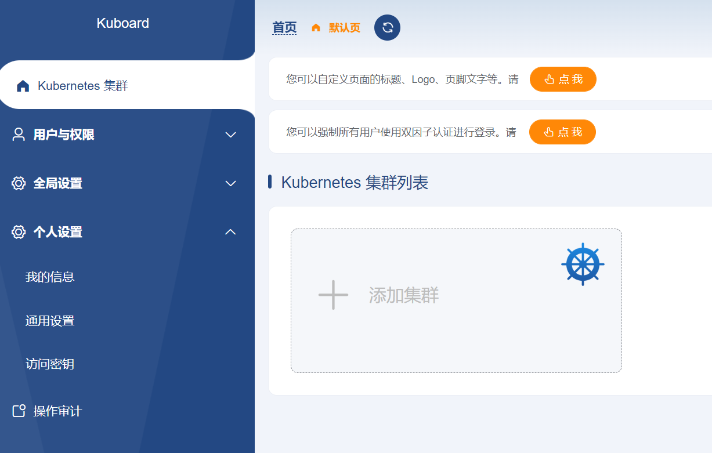
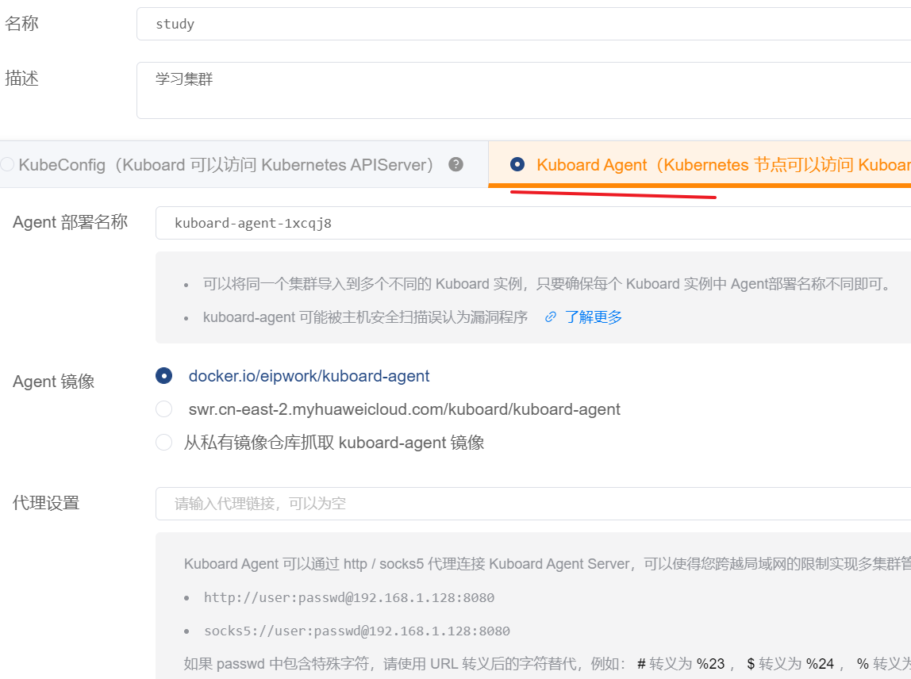
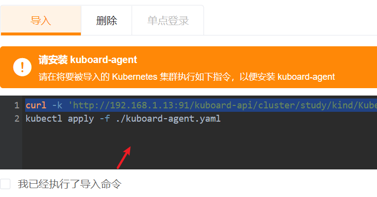
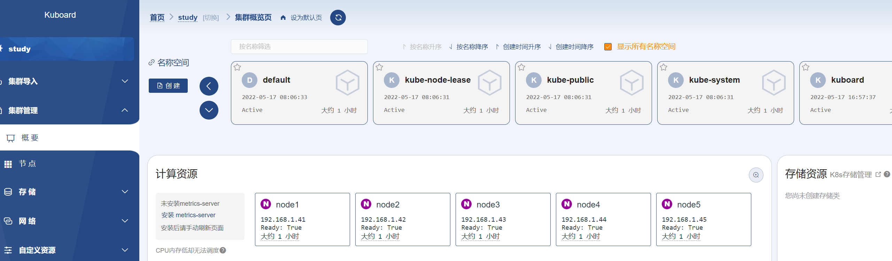

# 多集群部署

## 简单的部署
新手建议使用这个项目 https://github.com/labring/sealos

我们有5台机器，1个maser和4个node(都是ubuntu20.04)
- `192.168.1.41` master
- `192.168.1.42` node
- `192.168.1.43` node
- `192.168.1.44` node
- `192.168.1.45` node

> 这5台机器账号密码都一样，并且是开启了root访问

```bash
# 使用root身份运行下面的内容
sealos init --user root --passwd xiaoyou --master 192.168.1.41 --node 192.168.1.42 --node 192.168.1.43 --node 192.168.1.44 --node 192.168.1.45 --pkg-url /home/xiaoyou/kube1.22.0.tar.gz --version v1.22.0
```


其他常用命令

```bash
# 添加master
sealos join --master 192.168.0.6 --master 192.168.0.7
# 添加节点
sealos join --node 192.168.0.6 --node 192.168.0.7
# 删除某个节点
sealos clean --master 192.168.0.2
sealos clean --node 192.168.0.5
# 删除所有集群
sealos clean --all
# 查看所有节点
kubectl get nodes
# 开启端口服务
kubectl proxy --address='0.0.0.0'  --accept-hosts='^*$' --port=8081
```

## 可视化管理界面部署
### Kuboard 

安装地址 https://kuboard.cn/install/v3/install-built-in.html#%E9%83%A8%E7%BD%B2%E8%AE%A1%E5%88%92

自己再另外找一台机器来运行web服务，我们机器ip地址是`192.168.1.13`，然后web服务对外提供了`91`号端口，使用docker直接运行

```bash
sudo docker run -d \
  --restart=always \
  --name=kuboard \
  -p 91:80/tcp \
  -p 10081:10081/tcp \
  -e KUBOARD_ENDPOINT="http://192.168.1.60:91" \
  -e KUBOARD_AGENT_SERVER_TCP_PORT="10081" \
  -v /root/kuboard-data:/data \
  eipwork/kuboard:v3
```
然后访问 `192.168.1.13:91` 就可以进来了，账号是 `admin` ,密码是 `Kuboard123`，效果如下：



下面我们添加一下集群，使用agent来导入



然后会给你一个命令，按照这个命令来执行即可



最后就可以看到效果了




### kubesphere

https://github.com/kubesphere/kubesphere

## 常用命令
```bash
# 查找所有节点
kubectl get nodes
# 查看某一个节点的详细信息(nodename换成节点名称)
kubectl describe node <nodename>
```

## rancher
官网 https://github.com/rancher/rancher
```bash
docker run -d --privileged --restart=unless-stopped \
  -p 92:80 -p 93:443 \
  rancher/rancher:latest
```

token访问
https://blog.csdn.net/weixin_38320674/article/details/107328982


docker run -d --name nexus3 --restart=always -p 92:8081 -v /data/noraml/nexus:/nexus-data sonatype/nexus3

sudo docker run -d -p 82:9000 -p 93:9443 --name portainer \
    --restart=always \
    -v /var/run/docker.sock:/var/run/docker.sock \
    -v portainer_data:/data \
    portainer/portainer-ce:2.9.3