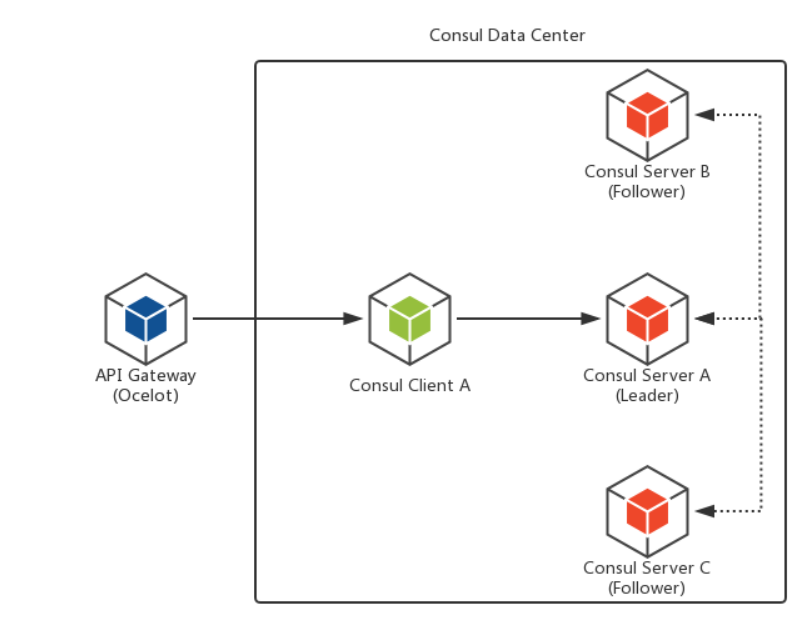
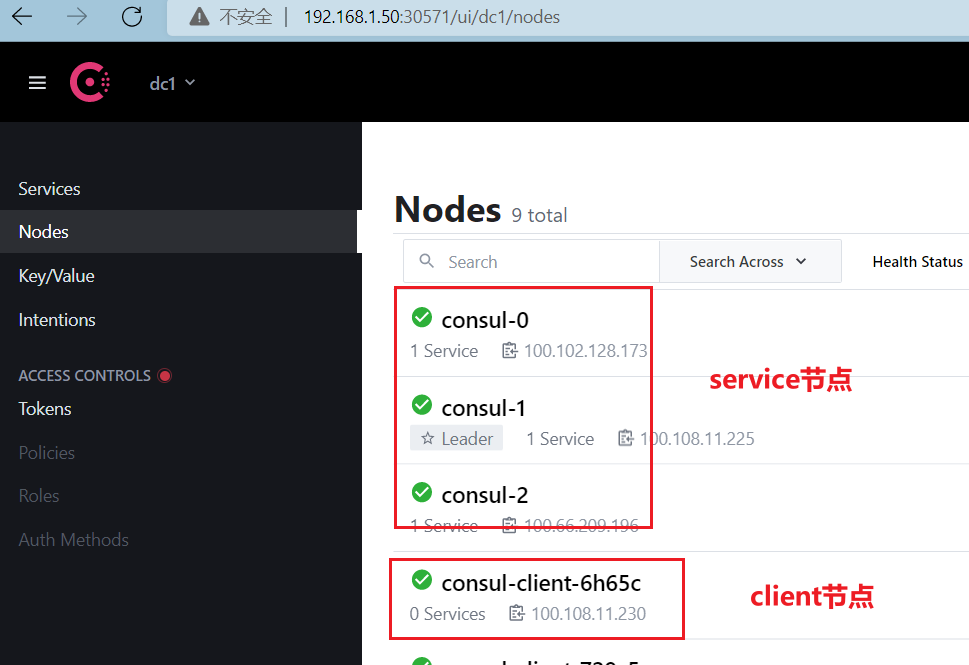

# consul
Consul包含多个组件,但是作为一个整体,为你的基础设施提供服务发现和服务配置的工具.他提供以下关键特性:

- 服务发现 Consul的客户端可用提供一个服务,比如 api 或者mysql ,另外一些客户端可用使用Consul去发现一个指定服务的提供者.通过DNS或者HTTP应用程序可用很容易的找到他所依赖的服务.

- 健康检查 Consul客户端可用提供任意数量的健康检查,指定一个服务(比如:webserver是否返回了200 OK 状态码)或者使用本地节点(比如:内存使用是否大于90%). 这个信息可由operator用来监视集群的健康.被服务发现组件用来避免将流量发送到不健康的主机.

- Key/Value存储 应用程序可用根据自己的需要使用Consul的层级的Key/Value存储.比如动态配置,功能标记,协调,领袖选举等等,简单的HTTP API让他更易于使用.

- 多数据中心: Consul支持开箱即用的多数据中心.这意味着用户不需要担心需要建立额外的抽象层让业务扩展到多个区域.

Consul面向DevOps和应用开发者友好.是他适合现代的弹性的基础设施.

整体架构图如下：



## 搭建

参考：https://blog.csdn.net/skh2015java/article/details/108853992

我们这里搭建了三个service节点，6个client节点，配置文件如下：

```yaml

---
kind: DaemonSet
apiVersion: apps/v1
metadata:
  name: consul-client
  namespace: xiaoyou-dev
  labels:
    k8s.kuboard.cn/layer: gateway
    k8s.kuboard.cn/name: consul-client
  annotations:
    deprecated.daemonset.template.generation: '5'
    k8s.kuboard.cn/displayName: 服务发现(consul-client)
spec:
  selector:
    matchLabels:
      k8s.kuboard.cn/layer: gateway
      k8s.kuboard.cn/name: consul-client
  template:
    metadata:
      creationTimestamp: null
      labels:
        k8s.kuboard.cn/layer: gateway
        k8s.kuboard.cn/name: consul-client
      annotations:
        kubectl.kubernetes.io/restartedAt: '2022-06-06T10:16:40+08:00'
    spec:
      volumes:
        - name: volume-zxbfh
          persistentVolumeClaim:
            claimName: micro-service
      containers:
        - name: client
          image: registry.xiaoyou.com/library/consul
          args:
            - agent
            - '-data-dir=/consul/data'
            - '-bind=0.0.0.0'
            - '-client=0.0.0.0'
            - '-advertise=$(POD_IP)'
            - '-retry-join=consul-0.consul.$(NAMESPACE).svc.cluster.local'
            - '-retry-join=consul-1.consul.$(NAMESPACE).svc.cluster.local'
            - '-retry-join=consul-2.consul.$(NAMESPACE).svc.cluster.local'
            - '-domain=cluster.local'
            - '-disable-host-node-id'
          ports:
            - name: http
              containerPort: 8500
              protocol: TCP
            - name: rpc
              containerPort: 8400
              protocol: TCP
            - name: https
              containerPort: 8443
              protocol: TCP
            - name: serf-wan
              containerPort: 8302
              protocol: TCP
            - name: consul
              containerPort: 8600
              protocol: TCP
            - name: server
              containerPort: 8300
              protocol: TCP
            - name: serf-lan
              containerPort: 8301
              protocol: TCP
          env:
            - name: POD_IP
              valueFrom:
                fieldRef:
                  apiVersion: v1
                  fieldPath: status.podIP
            - name: NAMESPACE
              valueFrom:
                fieldRef:
                  apiVersion: v1
                  fieldPath: metadata.namespace
            - name: NODE_PATH
              valueFrom:
                fieldRef:
                  apiVersion: v1
                  fieldPath: metadata.name
          resources: {}
          volumeMounts:
            - name: volume-zxbfh
              mountPath: /consul/data
              subPathExpr: consul/client/$(NODE_PATH)
          terminationMessagePath: /dev/termination-log
          terminationMessagePolicy: File
          imagePullPolicy: Always
      restartPolicy: Always
      terminationGracePeriodSeconds: 30
      dnsPolicy: ClusterFirst
      securityContext: {}
      schedulerName: default-scheduler
  updateStrategy:
    type: RollingUpdate
    rollingUpdate:
      maxUnavailable: 1
      maxSurge: 0
  revisionHistoryLimit: 10

---
kind: StatefulSet
apiVersion: apps/v1
metadata:
  name: consul
  namespace: xiaoyou-dev
  labels:
    k8s.kuboard.cn/layer: web
    k8s.kuboard.cn/name: consul
  annotations:
    k8s.kuboard.cn/displayName: 服务发现(consul-service)
spec:
  replicas: 3
  selector:
    matchLabels:
      k8s.kuboard.cn/layer: gateway
      k8s.kuboard.cn/name: consul
  template:
    metadata:
      creationTimestamp: null
      labels:
        k8s.kuboard.cn/layer: gateway
        k8s.kuboard.cn/name: consul
    spec:
      volumes:
        - name: volume-erx2k
          persistentVolumeClaim:
            claimName: micro-service
      containers:
        - name: server
          image: registry.xiaoyou.com/library/consul
          args:
            - agent
            - '-server'
            - '-bootstrap-expect=3'
            - '-ui'
            - '-data-dir=/consul/data'
            - '-bind=0.0.0.0'
            - '-client=0.0.0.0'
            - '-advertise=$(PODIP)'
            - '-retry-join=consul-0.consul.$(NAMESPACE).svc.cluster.local'
            - '-retry-join=consul-1.consul.$(NAMESPACE).svc.cluster.local'
            - '-retry-join=consul-2.consul.$(NAMESPACE).svc.cluster.local'
            - '-domain=cluster.local'
            - '-disable-host-node-id'
          ports:
            - name: http
              containerPort: 8500
              protocol: TCP
            - name: rpc
              containerPort: 8400
              protocol: TCP
            - name: https-port
              containerPort: 8443
              protocol: TCP
            - name: serf-lan
              containerPort: 8301
              protocol: TCP
            - name: serf-wan
              containerPort: 8302
              protocol: TCP
            - name: consul-dns
              containerPort: 8600
              protocol: TCP
            - name: server
              containerPort: 8300
              protocol: TCP
          env:
            - name: PODIP
              valueFrom:
                fieldRef:
                  apiVersion: v1
                  fieldPath: status.podIP
            - name: NAMESPACE
              valueFrom:
                fieldRef:
                  apiVersion: v1
                  fieldPath: metadata.namespace
            - name: NODE_PATH
              valueFrom:
                fieldRef:
                  apiVersion: v1
                  fieldPath: metadata.name
          resources: {}
          volumeMounts:
            - name: volume-erx2k
              mountPath: /consul/data
              subPathExpr: consul/service/$(NODE_PATH)
          terminationMessagePath: /dev/termination-log
          terminationMessagePolicy: File
          imagePullPolicy: Always
      restartPolicy: Always
      terminationGracePeriodSeconds: 30
      dnsPolicy: ClusterFirst
      securityContext: {}
      schedulerName: default-scheduler
  serviceName: consul
  podManagementPolicy: OrderedReady
  updateStrategy:
    type: RollingUpdate
    rollingUpdate:
      partition: 0
  revisionHistoryLimit: 10

---
kind: Service
apiVersion: v1
metadata:
  name: consul
  namespace: xiaoyou-dev
  labels:
    k8s.kuboard.cn/layer: web
    k8s.kuboard.cn/name: consul
spec:
  ports:
    - name: pfjgz7
      protocol: TCP
      port: 8500
      targetPort: 8500
      nodePort: 30571
  selector:
    k8s.kuboard.cn/layer: gateway
    k8s.kuboard.cn/name: consul
  type: NodePort
  sessionAffinity: None
  externalTrafficPolicy: Cluster
  ipFamilies:
    - IPv4
  ipFamilyPolicy: SingleStack
  internalTrafficPolicy: Cluster
```

访问这个集群结果如下，如果所有的节点都在线说明安装成功：

