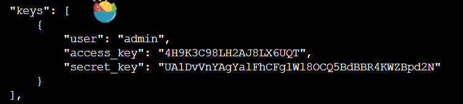
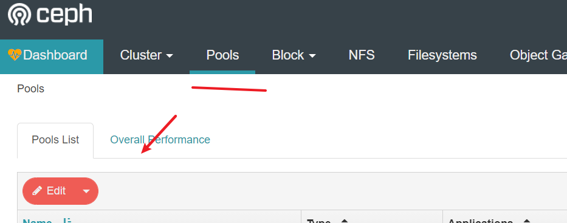
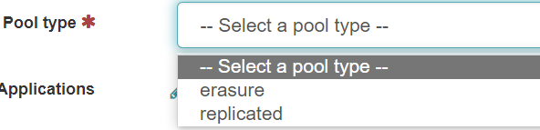
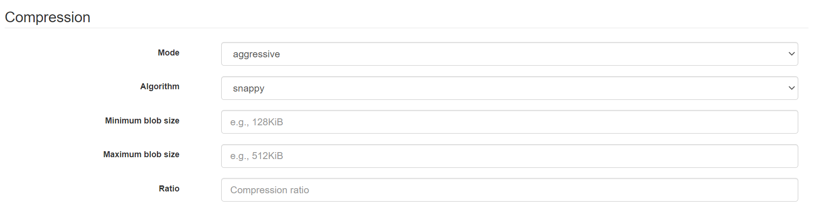

> k8s部署太麻烦了，这里直接使用docker来进行部署。。

## 搭建

> 这里我们是挂载了一块4T的机械硬盘到`/data/storage`目录下，下面这个只是创建一个的，我们我们可以创建三个文件用于测试

### 虚拟磁盘（可选，我没有弄这个）
```bash
# 首先我们先创建一个文件夹用来存储信息
mkdir -p /data/storage/ceph-disk
# 创建一个20G的空文件
sudo dd if=/dev/zero of=/data/storage/ceph-disk/ceph-disk-01 bs=1G count=20
# 把这个文件虚拟为块设备
sudo losetup -f /data/storage/ceph-disk/ceph-disk-01
# 使用sudo fdisk -l命令来查找
# 格式化这个设备
sudo mkfs.xfs -f /dev/loop8
# 挂载我们的设备
sudo mkdir -p /dev/osd1
sudo mount /dev/loop8  /dev/osd1
```

### docker搭建

参考：
- https://juejin.cn/post/6901460993235386382#comment
- https://www.cnblogs.com/hackyo/p/13373340.html

```bash
# 搭建一个专用网络
sudo docker network create --driver bridge --subnet 172.20.0.0/16 ceph-network
# 拉取镜像
sudo docker pull ceph/daemon:latest-nautilus
# 搭建mon节点
sudo docker run -d --name ceph-mon --network ceph-network --ip 172.20.0.10 -e CLUSTER=ceph -e WEIGHT=1.0 -e MON_IP=172.20.0.10 -e MON_NAME=ceph-mon -e CEPH_PUBLIC_NETWORK=172.20.0.0/16 -v /etc/ceph:/etc/ceph -v /var/lib/ceph:/var/lib/ceph/ -v /data/storage/ceph/log:/var/log/ceph/ ceph/daemon:latest-nautilus mon
# 生成一下鉴权信息
sudo docker exec ceph-mon ceph auth get client.bootstrap-osd -o /var/lib/ceph/bootstrap-osd/ceph.keyring
# 修改配置文件，用于兼容ext4（如果用虚拟磁盘可以不加）
sudo vim /etc/ceph/ceph.conf
# 加上下面两行
osd max object name len = 256
osd max object namespace len = 64
# 下面我们搭建三个容器来模拟集群（把/var/lib/ceph/osd映射为自己挂载的硬盘）
sudo docker run -d --privileged=true --name ceph-osd-1 --network ceph-network --ip 172.20.0.11 -e CLUSTER=ceph -e WEIGHT=1.0 -e MON_NAME=ceph-mon -e MON_IP=172.20.0.10  -v /etc/ceph:/etc/ceph -v /var/lib/ceph:/var/lib/ceph/ -v /dev/osd1:/var/lib/ceph/osd -v /etc/localtime:/etc/localtime:ro ceph/daemon:latest-nautilus osd

sudo docker run -d --privileged=true --name ceph-osd-2 --network ceph-network --ip 172.20.0.12 -e CLUSTER=ceph -e WEIGHT=1.0 -e MON_NAME=ceph-mon -e MON_IP=172.20.0.10 -e OSD_TYPE=directory -v /etc/ceph:/etc/ceph -v /var/lib/ceph:/var/lib/ceph/ -v /data/storage/ceph/osd2:/var/lib/ceph/osd -v /etc/localtime:/etc/localtime:ro ceph/daemon:latest-nautilus osd_directory

sudo docker run -d --privileged=true --name ceph-osd-3 --network ceph-network --ip 172.20.0.13 -e CLUSTER=ceph -e WEIGHT=1.0 -e MON_NAME=ceph-mon -e MON_IP=172.20.0.10 -e OSD_TYPE=directory -v /etc/ceph:/etc/ceph -v /var/lib/ceph:/var/lib/ceph/ -v /data/storage/ceph/osd3:/var/lib/ceph/osd -v /etc/localtime:/etc/localtime:ro ceph/daemon:latest-nautilus osd_directory

# 搭建mgr节点
sudo docker run -d --privileged=true --name ceph-mgr --network ceph-network --ip 172.20.0.14 -e CLUSTER=ceph -p 7000:7000 --pid=container:ceph-mon -v /etc/ceph:/etc/ceph -v /var/lib/ceph:/var/lib/ceph/ ceph/daemon:latest-nautilus mgr

# 生成rgw秘钥
sudo docker exec ceph-mon ceph auth get client.bootstrap-rgw -o /var/lib/ceph/bootstrap-rgw/ceph.keyring

# 搭建rgw节点
sudo docker run -d --privileged=true --name ceph-rgw --network ceph-network --ip 172.20.0.15 -e CLUSTER=ceph -e RGW_NAME=ceph-rgw -p 7480:7480 -v /var/lib/ceph:/var/lib/ceph/ -v /etc/ceph:/etc/ceph -v /etc/localtime:/etc/localtime:ro ceph/daemon:latest-nautilus rgw

# 查看ceph的运行状态
sudo docker exec ceph-mon ceph -s
```

### 打开监控面板
参考：https://dylanyang.top/post/2021/05/15/ceph-dashboard%E9%85%8D%E7%BD%AE/

> 默认的监控面板不能直接打开，需要我们配置一些基本信息，我们先进入mgr的容器执行下面的命令

```bash
# 打开管理面板
ceph mgr module enable dashboard
# 禁用SSL
ceph config set mgr mgr/dashboard/ssl false
# 配置端口和服务地址
ceph config set mgr mgr/dashboard/server_addr 0.0.0.0
ceph config set mgr mgr/dashboard/server_port 7000
# 设置一下密码（这个设置密码需要自己先新建一个文件，然后把密码写到这个文件里去）
vi pass
# 设置账号密码,用户名叫xiaoyou
ceph dashboard ac-user-create xiaoyou -i pass administrator
# 最后重启一下容器即可
```

### 监控面板显示对象存储
> 默认这个监控面板无法显示对象存储的信息，需要我们开启这个功能，同样是进入mgr容器
```bash
# 创建一个管理员用户
radosgw-admin user create --uid=admin --display-name=admin --system
```
复制里面的access和secret


```bash
# 查看用户信息
radosgw-admin user info --uid=admin

# 自己先把这些access和secret信息写入到我们的文件中，设置控制面板的access和秘钥（-i后面自己新建一个文件）
ceph dashboard set-rgw-api-access-key -i <file-containing-access-key>
ceph dashboard set-rgw-api-secret-key -i <file-containing-secret-key>
# 设置协议
ceph dashboard set-rgw-api-scheme http
# 设置用户
ceph dashboard set-rgw-api-user-id admin
# 最后重启一下mgr
```

### 修改OSD容量

> 监控面板显示我的OSD容量只有100G


## 使用指南

### 新建存储池
首先我们所有的数据都放在存储池中，可以在下面这个地方新建一个存储池


默认的存储的副本是3，我们单机部署只需要设置一份即可。。

存储池分为两种一种是副本，另外一种是纠错码（副本可以设置副本个数，也就是数据备份多少份）


Placement groups（PG）表示放置组的大小，计算公式如下（直接默认就行。。）
```
             (OSDs * 100)
Total PGs =  ------------
              pool size
```

下面是压缩的配置

> 压缩主要还是起到一个缩小数据量的作用



- None，不进行压缩；
- Passive，除非写请求自带压缩hint，否则不进行压缩；
- Aggressive，除非写请求中有不压缩的hint，否则全部进行压缩；
- Force，无视其他，对所有写请求全部进行压缩。

Ratio压缩比例：数据块压缩之后的大小和原始数据大小的比例。只有压缩比等于或低于该比例，压缩才会进行。否则，如果一份数据经过压缩后没有达到一定的压缩比例，该数据不会进行压缩，而将直接存储原始数据。例如，该比例设置为0.7，则在写操作中，只有那些经过压缩后的数据是原始数据的70%，或者更少的数据才能被压缩后进行存储。

最小blob大小（Compression Min blob Size）：如果需要压缩的数据块小于该值，则不进行压缩，原文存储。该值针对硬盘驱动器和固态硬盘可以设置不同大小。

最大blob大小（Compression Max blob Size）：如果需要压缩的数据块大于该值，则会分成若干个数据块进行压缩。该值针对硬盘驱动器和固态硬盘可以设置不同大小。


### 使用Wimbledon的存储池
参考：http://www.yangguanjun.com/2017/05/08/rgw-user-config-datapool/

这个服务用的是默认的存储池，我们可以修改一下，使用我们自己的存储池

```bash
# 查看一下所有的
radosgw-admin zone placement list  --rgw-zone=default
# 创建一个账号
radosgw-admin user create  --uid='xiaoyou' --display-name='xiaoyou' --access-key='xiaoyou' --secret='xiaoyou'
```


## 参考
- https://blog.csdn.net/cyq6239075/article/details/107429839