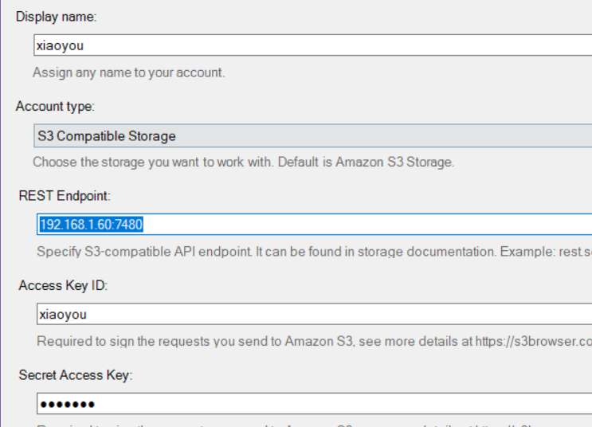
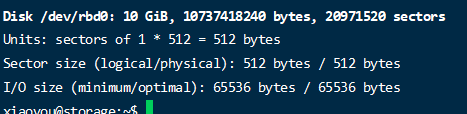

> k8s部署太麻烦了，这里直接使用docker来进行部署。。

## 搭建

> 这里我们是挂载了一块4T的机械硬盘到`/data/storage`目录下，下面这个只是创建一个的，我们我们可以创建三个文件用于测试

### 虚拟磁盘（可选，我没有弄这个）
```bash
# 首先我们先创建一个文件夹用来存储信息
mkdir -p /data/storage/ceph-disk
# 创建一个20G的空文件
sudo dd if=/dev/zero of=/data/storage/ceph-disk/ceph-disk-01 bs=1G count=20
# 把这个文件虚拟为块设备
sudo losetup -f /data/storage/ceph-disk/ceph-disk-01
# 使用sudo fdisk -l命令来查找
# 格式化这个设备
sudo mkfs.xfs -f /dev/loop8
# 挂载我们的设备
sudo mkdir -p /dev/osd1
sudo mount /dev/loop8  /dev/osd1
```

### docker搭建

参考：
- https://juejin.cn/post/6901460993235386382#comment
- https://www.cnblogs.com/hackyo/p/13373340.html

```bash
# 搭建一个专用网络
sudo docker network create --driver bridge --subnet 172.20.0.0/16 ceph-network
# 拉取镜像
sudo docker pull ceph/daemon:latest-nautilus
# 搭建mon节点
sudo docker run -d --name ceph-mon --network ceph-network --ip 172.20.0.10 -e CLUSTER=ceph -e WEIGHT=1.0 -e MON_IP=172.20.0.10 -e MON_NAME=ceph-mon -e CEPH_PUBLIC_NETWORK=172.20.0.0/16 -v /data/storage/ceph/etc:/etc/ceph -v /data/storage/ceph/lib:/var/lib/ceph/ -v /data/storage/ceph/log:/var/log/ceph/ ceph/daemon:latest-nautilus mon
# 生成一下鉴权信息
sudo docker exec ceph-mon ceph auth get client.bootstrap-osd -o /var/lib/ceph/bootstrap-osd/ceph.keyring
# 修改配置文件，用于兼容ext4（如果用虚拟磁盘可以不加）
sudo vim /data/storage/ceph/etc/ceph.conf
# 加上下面两行
osd max object name len = 256
osd max object namespace len = 64
# 下面我们搭建10个容器来模拟集群(自己可以可以随便搞几个集群)（把/var/lib/ceph/osd映射为自己挂载的硬盘）
sudo docker run -d --privileged=true --name ceph-osd-1 --network ceph-network --ip 172.20.0.11 -e CLUSTER=ceph -e WEIGHT=1.0 -e MON_NAME=ceph-mon -e MON_IP=172.20.0.10  -e OSD_TYPE=directory -v /data/storage/ceph/etc:/etc/ceph -v /data/storage/ceph/lib:/var/lib/ceph/ -v /data/storage/ceph/osd:/var/lib/ceph/osd -v /etc/localtime:/etc/localtime:ro ceph/daemon:latest-nautilus osd

sudo docker run -d --privileged=true --name ceph-osd-2 --network ceph-network --ip 172.20.0.12 -e CLUSTER=ceph -e WEIGHT=1.0 -e MON_NAME=ceph-mon -e MON_IP=172.20.0.10 -e OSD_TYPE=directory -v /data/storage/ceph/etc:/etc/ceph -v /data/storage/ceph/lib:/var/lib/ceph/ -v /data/storage/ceph/osd2:/var/lib/ceph/osd -v /etc/localtime:/etc/localtime:ro ceph/daemon:latest-nautilus osd_directory

sudo docker run -d --privileged=true --name ceph-osd-3 --network ceph-network --ip 172.20.0.13 -e CLUSTER=ceph -e WEIGHT=1.0 -e MON_NAME=ceph-mon -e MON_IP=172.20.0.10 -e OSD_TYPE=directory -v /data/storage/ceph/etc:/etc/ceph -v /data/storage/ceph/lib:/var/lib/ceph/ -v /data/storage/ceph/osd3:/var/lib/ceph/osd -v /etc/localtime:/etc/localtime:ro ceph/daemon:latest-nautilus osd_directory

sudo docker run -d --privileged=true --name ceph-osd-4 --network ceph-network --ip 172.20.0.14 -e CLUSTER=ceph -e WEIGHT=1.0 -e MON_NAME=ceph-mon -e MON_IP=172.20.0.10 -e OSD_TYPE=directory -v /data/storage/ceph/etc:/etc/ceph -v /data/storage/ceph/lib:/var/lib/ceph/ -v /data/storage/ceph/osd4:/var/lib/ceph/osd -v /etc/localtime:/etc/localtime:ro ceph/daemon:latest-nautilus osd_directory

sudo docker run -d --privileged=true --name ceph-osd-5 --network ceph-network --ip 172.20.0.15 -e CLUSTER=ceph -e WEIGHT=1.0 -e MON_NAME=ceph-mon -e MON_IP=172.20.0.10 -e OSD_TYPE=directory -v /data/storage/ceph/etc:/etc/ceph -v /data/storage/ceph/lib:/var/lib/ceph/ -v /data/storage/ceph/osd5:/var/lib/ceph/osd -v /etc/localtime:/etc/localtime:ro ceph/daemon:latest-nautilus osd_directory

sudo docker run -d --privileged=true --name ceph-osd-6 --network ceph-network --ip 172.20.0.16 -e CLUSTER=ceph -e WEIGHT=1.0 -e MON_NAME=ceph-mon -e MON_IP=172.20.0.10 -e OSD_TYPE=directory -v /data/storage/ceph/etc:/etc/ceph -v /data/storage/ceph/lib:/var/lib/ceph/ -v /data/storage/ceph/osd6:/var/lib/ceph/osd -v /etc/localtime:/etc/localtime:ro ceph/daemon:latest-nautilus osd_directory

sudo docker run -d --privileged=true --name ceph-osd-7 --network ceph-network --ip 172.20.0.17 -e CLUSTER=ceph -e WEIGHT=1.0 -e MON_NAME=ceph-mon -e MON_IP=172.20.0.10 -e OSD_TYPE=directory -v /data/storage/ceph/etc:/etc/ceph -v /data/storage/ceph/lib:/var/lib/ceph/ -v /data/storage/ceph/osd7:/var/lib/ceph/osd -v /etc/localtime:/etc/localtime:ro ceph/daemon:latest-nautilus osd_directory

sudo docker run -d --privileged=true --name ceph-osd-8 --network ceph-network --ip 172.20.0.18 -e CLUSTER=ceph -e WEIGHT=1.0 -e MON_NAME=ceph-mon -e MON_IP=172.20.0.10 -e OSD_TYPE=directory -v /data/storage/ceph/etc:/etc/ceph -v /data/storage/ceph/lib:/var/lib/ceph/ -v /data/storage/ceph/osd8:/var/lib/ceph/osd -v /etc/localtime:/etc/localtime:ro ceph/daemon:latest-nautilus osd_directory

sudo docker run -d --privileged=true --name ceph-osd-9 --network ceph-network --ip 172.20.0.19 -e CLUSTER=ceph -e WEIGHT=1.0 -e MON_NAME=ceph-mon -e MON_IP=172.20.0.10 -e OSD_TYPE=directory -v /data/storage/ceph/etc:/etc/ceph -v /data/storage/ceph/lib:/var/lib/ceph/ -v /data/storage/ceph/osd9:/var/lib/ceph/osd -v /etc/localtime:/etc/localtime:ro ceph/daemon:latest-nautilus osd_directory

sudo docker run -d --privileged=true --name ceph-osd-10 --network ceph-network --ip 172.20.0.20 -e CLUSTER=ceph -e WEIGHT=1.0 -e MON_NAME=ceph-mon -e MON_IP=172.20.0.10 -e OSD_TYPE=directory -v /data/storage/ceph/etc:/etc/ceph -v /data/storage/ceph/lib:/var/lib/ceph/ -v /data/storage/ceph/osd10:/var/lib/ceph/osd -v /etc/localtime:/etc/localtime:ro ceph/daemon:latest-nautilus osd_directory

# 搭建mgr节点
sudo docker run -d --privileged=true --name ceph-mgr --network ceph-network --ip 172.20.0.50 -e CLUSTER=ceph -p 7000:7000 --pid=container:ceph-mon -v /data/storage/ceph/etc:/etc/ceph -v /data/storage/ceph/lib:/var/lib/ceph/ ceph/daemon:latest-nautilus mgr

# 生成rgw秘钥
sudo docker exec ceph-mon ceph auth get client.bootstrap-rgw -o /var/lib/ceph/bootstrap-rgw/ceph.keyring

# 搭建rgw节点
sudo docker run -d --privileged=true --name ceph-rgw --network ceph-network --ip 172.20.0.51 -e CLUSTER=ceph -e RGW_NAME=ceph-rgw -p 7480:7480 -v /data/storage/ceph/lib:/var/lib/ceph/ -v /data/storage/ceph/etc:/etc/ceph -v /etc/localtime:/etc/localtime:ro ceph/daemon:latest-nautilus rgw

# 查看ceph的运行状态
sudo docker exec ceph-mon ceph -s
```


### 打开监控面板
参考：https://dylanyang.top/post/2021/05/15/ceph-dashboard%E9%85%8D%E7%BD%AE/

> 默认的监控面板不能直接打开，需要我们配置一些基本信息，我们先进入mgr的容器执行下面的命令

```bash
# 打开管理面板
ceph mgr module enable dashboard
# 禁用SSL
ceph config set mgr mgr/dashboard/ssl false
# 配置端口和服务地址
ceph config set mgr mgr/dashboard/server_addr 0.0.0.0
ceph config set mgr mgr/dashboard/server_port 7000
# 设置一下密码（这个设置密码需要自己先新建一个文件，然后把密码写到这个文件里去）
vi pass
# 设置账号密码,用户名叫xiaoyou
ceph dashboard ac-user-create xiaoyou -i pass administrator
# 最后重启一下容器即可
```

### 监控面板显示对象存储
> 默认这个监控面板无法显示对象存储的信息，需要我们开启这个功能，同样是进入mgr容器
```bash
# 创建一个管理员用户
radosgw-admin user create --uid=admin --display-name=admin --system
```
复制里面的access和secret


FOT3ZGIO4MNTQVMQDHS0
aywlGt9AmuBVw1VNsvQdN6COOfQAnIZy1XwfAKBJ

```bash
# 把access和secret信息写入到我们的文件中
vi access
vi secret
# 查看用户信息
radosgw-admin user info --uid=admin

# 自己先把，设置控制面板的access和秘钥（-i后面自己新建一个文件）
ceph dashboard set-rgw-api-access-key -i access
ceph dashboard set-rgw-api-secret-key -i secret
# 设置协议
ceph dashboard set-rgw-api-scheme http
# 设置用户
ceph dashboard set-rgw-api-user-id admin
# 最后刷新一下就可以了
```

## 使用指南

### 新建存储池
首先我们所有的数据都放在存储池中，可以在下面这个地方新建一个存储池


默认的存储的副本是3，我们单机部署只需要设置一份即可。。

存储池分为两种一种是副本，另外一种是纠错码（副本可以设置副本个数，也就是数据备份多少份）


Placement groups（PG）表示放置组的大小，计算公式如下（直接默认就行。。）
```
             (OSDs * 100)
Total PGs =  ------------
              pool size
```

下面是压缩的配置

> 压缩主要还是起到一个缩小数据量的作用


- None，不进行压缩；
- Passive，除非写请求自带压缩hint，否则不进行压缩；
- Aggressive，除非写请求中有不压缩的hint，否则全部进行压缩；
- Force，无视其他，对所有写请求全部进行压缩。

Ratio压缩比例：数据块压缩之后的大小和原始数据大小的比例。只有压缩比等于或低于该比例，压缩才会进行。否则，如果一份数据经过压缩后没有达到一定的压缩比例，该数据不会进行压缩，而将直接存储原始数据。例如，该比例设置为0.7，则在写操作中，只有那些经过压缩后的数据是原始数据的70%，或者更少的数据才能被压缩后进行存储。

最小blob大小（Compression Min blob Size）：如果需要压缩的数据块小于该值，则不进行压缩，原文存储。该值针对硬盘驱动器和固态硬盘可以设置不同大小。

最大blob大小（Compression Max blob Size）：如果需要压缩的数据块大于该值，则会分成若干个数据块进行压缩。该值针对硬盘驱动器和固态硬盘可以设置不同大小。


### 使用我们的存储池
参考：http://www.yangguanjun.com/2017/05/08/rgw-user-config-datapool/

这个服务用的是默认的存储池，默认是保存3个副本，我们这里不需要这么多，我们可以修改一下，使用我们自己的存储池

```bash
# 查看一下存储池
radosgw-admin zone placement list  --rgw-zone=default
# 导出配置
radosgw-admin zone get --rgw-zone=default > zone.info
# 这里直接修改data_pool，改成我们自己的
vi zone.info
# 重新更新一下
radosgw-admin zone set --rgw-zone=default < zone.info
```

### 使用对象存储

```bash
# 我们添加一个用户
radosgw-admin user create --uid="xiaoyou" --display-name="xiaoyou"
# ZW051VO0D3092DJD6QDD
# JbrFDp0SbEt0LwyCMQ5xAVYHloH85GzYSWdjOB8O
# 如果忘记了可以通过下面的命令来查看
radosgw-admin user info --uid xiaoyou
```

我们可以自己使用s3 browser来访问我们的对象存储仓库



### 使用块存储

> 快存储提供了一个连续的序列化空间，比如可以给虚拟机提供磁盘。

参考：https://cloud.tencent.com/developer/article/1592961

```bash
# 下面我们使用命令来完成操作，这里只是在容器里面演示测试
# 创建一个存储池，名字叫rbd
ceph osd pool create rbd 64 64
# 查看我们所有的存储池
ceph osd lspools
# 查看存储空间使用情况
ceph df
# 查看存储池PG和PGP的数量
ceph osd pool get rbd pg_num
ceph osd pool get rbd pgp_num
# 修改存储池PG和PGP的数量
ceph osd pool set rbd pg_num 128
ceph osd pool set rbd pgp_num 128

# 查看我们存储池副本大小
ceph osd pool get rbd size
# 修改存储池大小
ceph osd pool set rbd size 2

# 设置我们的存储池为rdb类型
ceph osd pool application enable <poolnaame> rbd
# 查看存储池类型
ceph osd pool application get rbd

# 下面我们来创建一个10G的块存储
rbd create -p rbd --image ceph-rbd-demo.img --size 10G 
# 查看所有的rbd镜像
rbd -p rbd ls

# 查看镜像的详细信息
rbd -p rbd info ceph-rbd-demo.img

# 关闭没用的feture
rbd -p happylau --image ceph-rbd-demo.img feature disable deep-flatten
rbd -p happylau --image ceph-rbd-demo.img feature disable fast-diff
rbd -p happylau --image ceph-rbd-demo.img feature disable object-map
rbd -p happylau --image ceph-rbd-demo.img feature disable exclusive-lock

# 注意，直接在docker里面执行命令会报错，参考：https://github.com/ceph/ceph-container/issues/1449
# 先在宿主机上执行
sudo modprobe rbd
# 然后我们进入到osd的docker里面再执行（docker需要特权模式）

# 挂载我们的设备
rbd map rbd/ceph-rbd-demo.img
```

此时我们的宿主机就已经挂上这块硬盘了，下面我们可以把它当成一块本地盘来使用



### 文件存储

> ceph提供了第三种存储方式就是文件存储，文件存储需要一个MDS节点
https://cloud.tencent.com/developer/article/1708924

```bash
# 使用下面的命令来创建一个MDS节点（如果已经有文件系统了，可以CEPHFS_CREATE=0）
sudo docker run -d --privileged=true --name ceph-mds --network ceph-network --ip 172.20.0.52 -e CLUSTER=ceph -e CEPHFS_CREATE=0 -e MDS_NAME=nfs -v /data/storage/ceph/lib:/var/lib/ceph/ -v /data/storage/ceph/etc:/etc/ceph -v /etc/localtime:/etc/localtime:ro ceph/daemon:latest-nautilus mds
# 进入mds容器，创建一个用户
ceph auth get-or-create client.cephfs mon 'allow r' mds 'allow r,allow rw path=/' osd 'allow rw pool=cephfs_data' -o ceph.client.cephfs.keyring
# 查看我们创建的key，我们可以复制一下这个key
cat ceph.client.cephfs.keyring
# 或者通过下面这个命令来查看
ceph auth get-key client.cephfs
# 我的是
AQBX3pVikImpGRAAiWxlQdx2pC1vIpWiH+SQVA==
# docker好像不能挂上去。。目前这个功能用不到，以后再看一下
mkdir /mnt/cephfs
mount -t ceph 192.168.1.60:6789:/ /mnt/cephfs -o name=cephfs,secret=AQBX3pVikImpGRAAiWxlQdx2pC1vIpWiH+SQVA==
# 查看挂载情况
df -h /mnt/cephfs/
```


### SDk使用指南
基于boto的
```bash
from distutils.command.build import build
import boto
import boto.s3.connection

# 配置域名，秘钥等信息
endpoint='192.168.1.60'
access_key='ZW051VO0D3092DJD6QDD'
secret_key='JbrFDp0SbEt0LwyCMQ5xAVYHloH85GzYSWdjOB8O'
# 连接服务,ip和端口分开
conn = boto.connect_s3(
        aws_access_key_id = access_key,
        aws_secret_access_key = secret_key,
        host = endpoint,
        is_secure=False,
        calling_format = boto.s3.connection.OrdinaryCallingFormat(),
        port=7480
        )
# 查看所有的bucket
# for bucket in conn.get_all_buckets():
#         print("{name}\t{created}".format(
#                 name = bucket.name,
#                 created = bucket.creation_date,
#         ))

# 手动创建一个bucket
# conn.create_bucket('xiaoyou66')

# 列出某个bucket的所有key
bucket = conn.get_bucket('xiaoyou')
# for key in bucket.list():
#         print("{name}\t{size}\t{modified}".format(
#                 name = key.name,
#                 size = key.size,
#                 modified = key.last_modified,
#             ))

# 删除bucket
# conn.delete_bucket(conn.get_bucket('xiaoyou66'))

# 新建一个object（文本形式）
# key = bucket.new_key('hello.txt')
# key.set_contents_from_string('hello,word')

# 新建一个object（从文件中）
key = bucket.new_key('hello.png')
key.set_contents_from_filename('/home/xiaoyou/s3/01.png')

# 修改object的权限
# hello_key = bucket.get_key('hello.txt')
# hello_key.set_canned_acl('public-read')
# plans_key = bucket.get_key('secret_plans.txt')
# plans_key.set_canned_acl('private')

# 下载bucket并保存
# key = bucket.get_key('heh/Python.pdf')
# key.get_contents_to_filename('/home/xiaoyou/python.pdf')

# 删除key
# bucket.delete_key('heh/Python.pdf')

# 生成一个分享的url
# hello_key = bucket.get_key('hello.txt')
# hello_url = hello_key.generate_url(0, query_auth=False, force_http=True)
# print(hello_url)

# 生成一个带过期时间的链接
# plans_key = bucket.get_key('hello.txt')
# plans_url = plans_key.generate_url(3600, query_auth=True, force_http=True)
# print(plans_url)
```

基于boto3
```bash
from boto3.session import Session
import boto3


# 配置域名，秘钥等信息
endpoint='http://192.168.1.60:7480'
access_key='ZW051VO0D3092DJD6QDD'
secret_key='JbrFDp0SbEt0LwyCMQ5xAVYHloH85GzYSWdjOB8O'


#Client初始化
session = Session(access_key, secret_key)
s3_client = session.client('s3', endpoint_url=endpoint)
#Client初始化结束
#列出该用户拥有的桶
print([bucket['Name'] for bucket in s3_client.list_buckets()['Buckets']])
# 上传文件
resp = s3_client.put_object(Bucket="xiaoyou", Key="a.png", Body=open("01.png", 'rb').read())
```

## 参考
- https://blog.csdn.net/cyq6239075/article/details/107429839