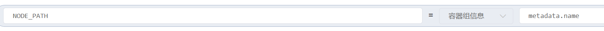

## 搭建指南

注意，这个镜像是5年前的，不建议生产环境使用！

参考：
https://blog.csdn.net/zz_aiytag/article/details/106398381

```bash
docker pull kubeguide/hadoop
```

直接使用下面这个安装就可以了

```bash
apiVersion: v1
kind: ConfigMap
metadata:
  name: kube-hadoop-conf-1  
  namespace: myns1
data:
  HDFS_MASTER_SERVICE: hadoop-hdfs-master
---
apiVersion: v1
kind: Service
metadata:
  # 修改会导致HDFS集群不可用
  name: hadoop-hdfs-master
  namespace: myns1
spec:
  type: NodePort
  selector:
    name: hdfs-master-3
  ports:
    - name: rpc
      port: 9000
      targetPort: 9000
    - name: http
      port: 50070
      targetPort: 50070
      nodePort: 32007
---
apiVersion: v1
kind: ReplicationController
metadata:
  name: hdfs-master-4
  namespace: myns1
  labels:
    name: hdfs-master-3
spec:
  replicas: 1
  selector:
    name: hdfs-master-3
  template:
    metadata:
      labels:
        name: hdfs-master-3
    spec:
      containers:
        - name: hdfs-master-6
          image: kubeguide/hadoop:latest
          imagePullPolicy: IfNotPresent
          ports:
            - containerPort: 9000
            - containerPort: 50070
          env:
            - name: HADOOP_NODE_TYPE
              value: namenode
            - name: HDFS_MASTER_SERVICE
              valueFrom:
                configMapKeyRef:
                  name: kube-hadoop-conf-1
                  key: HDFS_MASTER_SERVICE
      restartPolicy: Always
---
apiVersion: v1
kind: ReplicationController
metadata:
  name: hadoop-datanode-6
  namespace: myns1
  labels:
    app: hadoop-datanode-7
spec:
  replicas: 3
  selector:
    name: hadoop-datanode-7
  template:
    metadata:
      labels:
        name: hadoop-datanode-7
    spec:
      containers:
        - name: hadoop-datanode-8
          image: kubeguide/hadoop:latest
          imagePullPolicy: IfNotPresent
          ports:
            - containerPort: 9000
            - containerPort: 50070
          env:
            - name: HADOOP_NODE_TYPE
              value: datanode
            - name: HDFS_MASTER_SERVICE
              valueFrom:
                configMapKeyRef:
                  name: kube-hadoop-conf-1
                  key: HDFS_MASTER_SERVICE
      restartPolicy: Always
```

## 详细说明

上面这个只是搭建了一个master节点和3个node节点。
master节点有两个端口 50070 是HTTP的服务端口
然后9000是文件系统的端口

这个`hadoop-hdfs-master`表示主节点的服务名，node节点会自动连接

如果想持久化，可以把数据文件给映射出来 数据节点路径 `/root/hdfs/datanode`，名称节点路径 `/root/hdfs/namenode`(这个名称节点需要自己先把数据下载下来，然后再去挂载)

如果我们想设置三个节点，然后每个节点存储的位置不一样，可以这样想新建一个环境变量，使用`metadata.name`


然后存储挂载那里直接把自路径改成`hdfs/data/$(NODE_PATH)`，他就会自己去使用子路径的信息

## 管理工具

可以使用hue来管理（不过感觉可能是hdfs版本太低了，总是连不上，，先这样吧。。）
```
docker run -it -p 8888:8888 gethue/hue:latest
``
