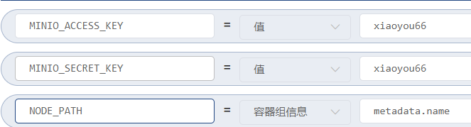

## MinIO 

这个对小文件支持不友好。每个文件都创建一个文件，太麻烦了。。。

参考：
- https://www.jianshu.com/p/2d45990dd652
- https://blog.csdn.net/weixin_40461281/article/details/118568289


可以设置账号密码：


注意这个工作负载要设置成 有状态副本集（StatefulSet）,这里我设置了四个节点
然后我们就可以通过下面这个启动命令

```bash
server --console-address :9001 http://minio-{0...3}.minio.xiaoyou-storage.svc.cluster.local/data
```

可以通过 `http://minio-{0...3}.minio.xiaoyou-storage.svc.cluster.local` 来访问四个节点中任意一个节点。

其实也可以简化一下`minio-x.minio` 也是可以的，当然要保证在同一个命名空间里

存储可以这样配置


放开`9000` 和 `9001` 这两个端口，访问90001就是web界面了

```yaml
---
apiVersion: apps/v1
kind: StatefulSet
metadata:
  annotations:
    k8s.kuboard.cn/displayName: minio对象存储
  labels:
    k8s.kuboard.cn/layer: web
    k8s.kuboard.cn/name: minio
  name: minio
  namespace: xiaoyou-storage
  resourceVersion: '2628303'
spec:
  podManagementPolicy: OrderedReady
  replicas: 4
  revisionHistoryLimit: 10
  selector:
    matchLabels:
      k8s.kuboard.cn/layer: web
      k8s.kuboard.cn/name: minio
  serviceName: minio
  template:
    metadata:
      creationTimestamp: null
      labels:
        k8s.kuboard.cn/layer: web
        k8s.kuboard.cn/name: minio
    spec:
      containers:
        - args:
            - server
            - '--console-address'
            - ':9001'
            - 'http://minio-{0...3}.minio/data'
          env:
            - name: MINIO_ACCESS_KEY
              value: xiaoyou66
            - name: MINIO_SECRET_KEY
              value: xiaoyou66
            - name: NODE_PATH
              valueFrom:
                fieldRef:
                  apiVersion: v1
                  fieldPath: metadata.name
          image: registry.xiaoyou.com/minio/minio
          imagePullPolicy: Always
          name: minio
          ports:
            - containerPort: 9000
              protocol: TCP
            - containerPort: 9001
              protocol: TCP
          resources: {}
          terminationMessagePath: /dev/termination-log
          terminationMessagePolicy: File
          volumeMounts:
            - mountPath: /data
              name: volume-cxpz3
              subPathExpr: minio/data/$(NODE_PATH)
      dnsPolicy: ClusterFirst
      restartPolicy: Always
      schedulerName: default-scheduler
      securityContext: {}
      terminationGracePeriodSeconds: 30
      volumes:
        - name: volume-cxpz3
          persistentVolumeClaim:
            claimName: xiaoyou-stroage
  updateStrategy:
    rollingUpdate:
      partition: 0
    type: RollingUpdate
status:
  availableReplicas: 4
  collisionCount: 0
  currentReplicas: 4
  currentRevision: minio-bc6475649
  observedGeneration: 22
  readyReplicas: 4
  replicas: 4
  updateRevision: minio-bc6475649
  updatedReplicas: 4
```